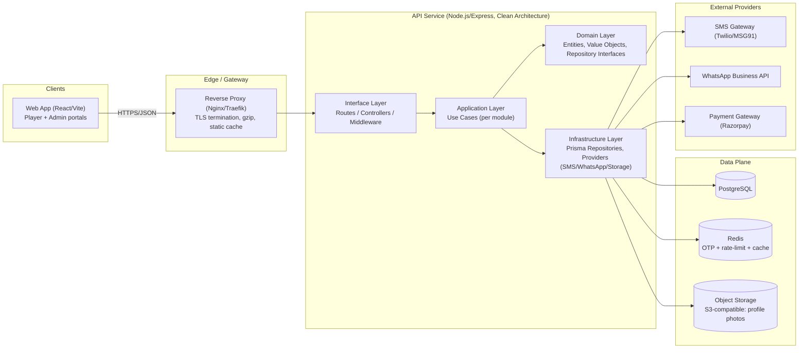
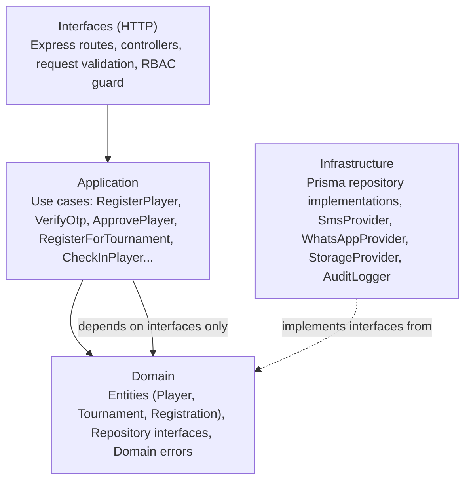
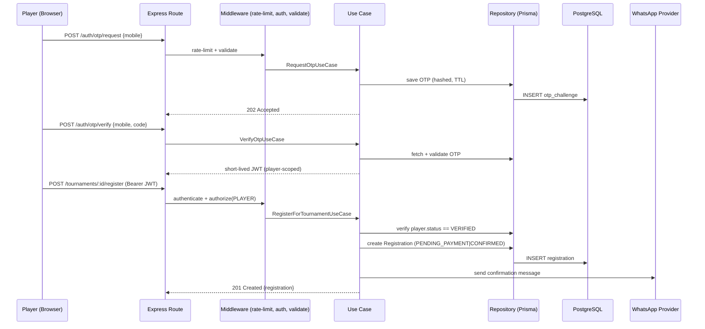
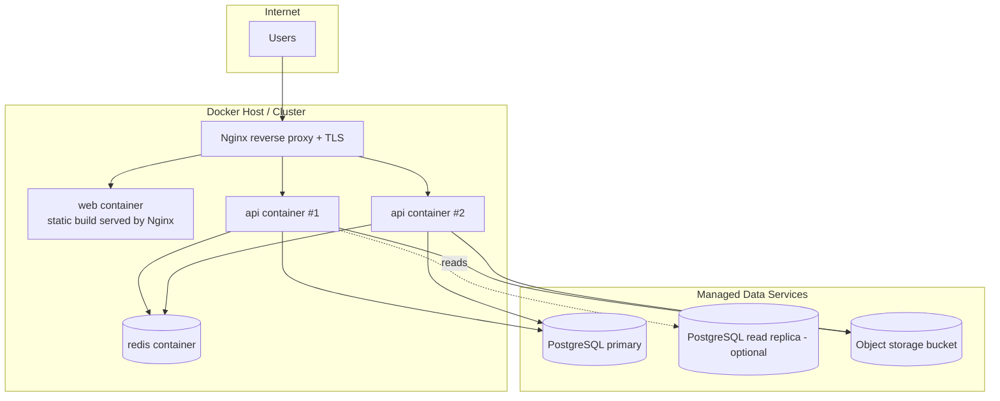
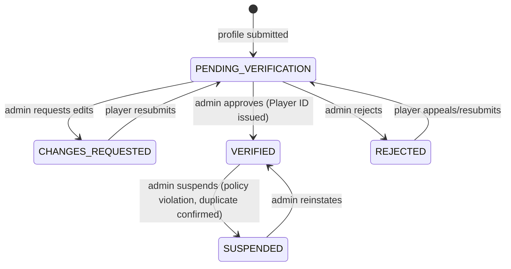
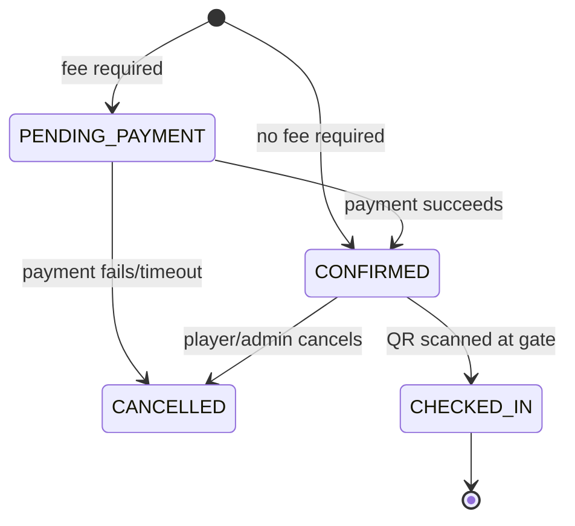

# System Architecture

## 1. High-Level Overview

## 2. Clean Architecture Layering (API)

Dependency direction always points **inward**. Outer layers depend on inner layers, never the reverse.

- **Domain** has zero framework imports. It defines `PlayerRepository`, `TournamentRepository`, etc. as interfaces (ports).
- **Application** orchestrates use cases using only domain interfaces — fully unit-testable with in-memory fakes, no DB needed.
- **Infrastructure** provides concrete adapters (Prisma-backed repositories, third-party API clients) — swappable without touching application logic.
- **Interfaces/HTTP** is the thinnest layer: parse request → call use case → map result to HTTP response.

## 3. Request Lifecycle (example: Tournament Registration)

## 4. Deployment Topology

## 5. Key Architectural Decisions (ADR summary)

| Decision | Choice | Rationale |
|---|---|---|
| Language/runtime | TypeScript on Node.js 20 | Single language across FE/BE, shared types package, strong ecosystem for OpenAPI/Prisma tooling. |
| ORM/DB | PostgreSQL + Prisma | Relational integrity for identity uniqueness, migrations-as-code, strong TypeScript types generated from schema. |
| Identity key | Verified mobile number (unique, indexed) | Matches the product requirement directly: "only mobile + OTP for every future registration." |
| Player ID issuance | At **approval** time, not registration time | Prevents ID exhaustion/waste from abandoned or rejected registrations. |
| Auth | JWT access (short TTL) + refresh (rotating, stored hashed) | Stateless horizontal scaling for the API; refresh rotation limits replay risk. |
| Caching/ephemeral state | Redis | OTP challenges, rate-limit counters, and short-lived session data need TTL semantics Postgres doesn't give cheaply. |
| File storage | Local disk (dev) / S3-compatible (prod) behind a `StorageProvider` interface | Decouples business logic from storage vendor; local dev needs zero cloud setup. |
| Messaging | Provider interface (`SmsProvider`, `WhatsAppProvider`) with a `console` dev implementation | Lets the whole registration flow be built/tested without live Twilio/Meta credentials; swap in prod via env var. |
| Architecture style | Clean Architecture + Repository Pattern | Keeps domain rules (uniqueness, verification state machine) testable and framework-agnostic; Prisma is a plug-in, not a foundation. |

## 6. Domain State Machines

### Player verification status

### Tournament registration status

