# Entity Relationship Diagram

Source of truth for the physical schema is [`apps/api/prisma/schema.prisma`](../apps/api/prisma/schema.prisma). This diagram is the conceptual view.

```mermaid
erDiagram
    ADMIN_USER ||--o{ AUDIT_LOG : "performs"
    ADMIN_USER ||--o{ PLAYER : "verifies"
    ADMIN_USER ||--o{ TOURNAMENT : "manages"
    ADMIN_USER ||--o{ MESSAGE_CAMPAIGN : "sends"

    PLAYER ||--o{ OTP_CHALLENGE : "requests"
    PLAYER ||--o{ REGISTRATION : "registers"
    PLAYER ||--o| MEDICAL_INFO : "optionally has"
    PLAYER ||--o{ REFRESH_TOKEN : "holds"
    PLAYER ||--o{ PLAYER_STAT : "accrues"
    PLAYER ||--o{ DUPLICATE_FLAG : "flagged as"
    PLAYER ||--o{ MESSAGE_LOG : "receives"

    TOURNAMENT ||--o{ REGISTRATION : "has"
    TOURNAMENT ||--o{ CHECKIN : "hosts"
    TOURNAMENT ||--o{ PLAYER_STAT : "scoped to"
    TOURNAMENT ||--o{ MESSAGE_CAMPAIGN : "targets"

    REGISTRATION ||--o| PAYMENT : "may have"
    REGISTRATION ||--o| CHECKIN : "results in"

    PLAYER {
        uuid id PK
        string player_id UK "e.g. AVI-000187, null until verified"
        string mobile UK "E.164, OTP-verified"
        string full_name
        date date_of_birth
        string gender
        string email
        string photo_url
        enum cricket_role "SUPER_STRIKER|ALL_ROUNDER|BATSMAN|BOWLER"
        enum batting_style "RIGHT_HAND|LEFT_HAND"
        enum bowling_style "RIGHT_ARM_FAST|RIGHT_ARM_SPIN|LEFT_ARM_FAST|LEFT_ARM_SPIN|NONE"
        int preferred_batting_position
        enum experience_level "BEGINNER|INTERMEDIATE|ADVANCED|PROFESSIONAL"
        string city
        string state
        string country
        string pincode
        string emergency_contact_name
        string emergency_contact_relation
        string emergency_contact_phone
        string jersey_size
        string jersey_number_pref1
        string jersey_number_pref2
        string jersey_name
        enum verification_status "PENDING_VERIFICATION|CHANGES_REQUESTED|VERIFIED|REJECTED|SUSPENDED"
        string rejection_reason
        uuid verified_by_admin_id FK
        timestamp verified_at
        timestamp created_at
        timestamp updated_at
        timestamp deleted_at
    }

    MEDICAL_INFO {
        uuid id PK
        uuid player_id FK
        string blood_group
        string allergies
        string conditions
        string medication
    }

    OTP_CHALLENGE {
        uuid id PK
        string mobile
        string code_hash
        enum purpose "REGISTRATION|LOGIN|TOURNAMENT_ENTRY"
        int attempts
        timestamp expires_at
        timestamp consumed_at
        timestamp created_at
    }

    REFRESH_TOKEN {
        uuid id PK
        uuid player_id FK
        string token_hash
        timestamp expires_at
        timestamp revoked_at
        timestamp created_at
    }

    ADMIN_USER {
        uuid id PK
        string email UK
        string password_hash
        string full_name
        enum role "SUPER_ADMIN|TOURNAMENT_ADMIN|SCANNER"
        boolean is_active
        timestamp created_at
    }

    TOURNAMENT {
        uuid id PK
        string name
        string slug UK
        text description
        string venue
        date start_date
        date end_date
        date registration_open_at
        date registration_close_at
        int max_participants
        decimal entry_fee
        boolean fee_required
        text rules_markdown
        enum status "DRAFT|PUBLISHED|REGISTRATION_CLOSED|IN_PROGRESS|COMPLETED|CANCELLED"
        uuid created_by_admin_id FK
        timestamp created_at
    }

    REGISTRATION {
        uuid id PK
        uuid player_id FK
        uuid tournament_id FK
        enum status "PENDING_PAYMENT|CONFIRMED|CHECKED_IN|CANCELLED"
        boolean rules_accepted
        timestamp rules_accepted_at
        string qr_token UK
        timestamp created_at
        timestamp updated_at
    }

    PAYMENT {
        uuid id PK
        uuid registration_id FK
        decimal amount
        string currency
        enum status "CREATED|SUCCEEDED|FAILED|REFUNDED"
        string provider_order_id
        string provider_payment_id
        timestamp created_at
    }

    CHECKIN {
        uuid id PK
        uuid registration_id FK
        uuid tournament_id FK
        uuid scanned_by_admin_id FK
        timestamp scanned_at
        string device_info
    }

    DUPLICATE_FLAG {
        uuid id PK
        uuid player_id FK
        uuid suspected_duplicate_player_id FK
        enum signal "NAME_DOB_MATCH|EMERGENCY_CONTACT_REUSE|PHOTO_HASH_MATCH"
        enum status "OPEN|DISMISSED|CONFIRMED_MERGED"
        timestamp created_at
    }

    MESSAGE_CAMPAIGN {
        uuid id PK
        string title
        enum channel "SMS|WHATSAPP|EMAIL"
        text template
        json audience_filter
        uuid tournament_id FK
        uuid created_by_admin_id FK
        timestamp sent_at
    }

    MESSAGE_LOG {
        uuid id PK
        uuid campaign_id FK
        uuid player_id FK
        enum status "QUEUED|SENT|FAILED|DELIVERED"
        string provider_message_id
        timestamp created_at
    }

    PLAYER_STAT {
        uuid id PK
        uuid player_id FK
        uuid tournament_id FK
        int matches_played
        int runs_scored
        int wickets_taken
        int catches
        timestamp updated_at
    }

    AUDIT_LOG {
        uuid id PK
        uuid actor_admin_id FK
        string action
        string entity_type
        uuid entity_id
        json before
        json after
        string ip_address
        timestamp created_at
    }
```

## Key constraints

- `player.mobile` — unique, indexed. This is the durable identity key referenced by the PRD.
- `player.player_id` — unique, nullable until `verification_status = VERIFIED`; generated exactly once at approval.
- `registration` — unique composite index on `(player_id, tournament_id)`: a player cannot double-register for the same tournament.
- `registration.qr_token` — unique, random 32-byte token encoded into the check-in QR; never the raw `player_id` or DB id (prevents enumeration/spoofing).
- All monetary values stored as `decimal(10,2)`, never floats.
- Soft delete (`deleted_at`) on `PLAYER` to preserve historical tournament/audit integrity.
